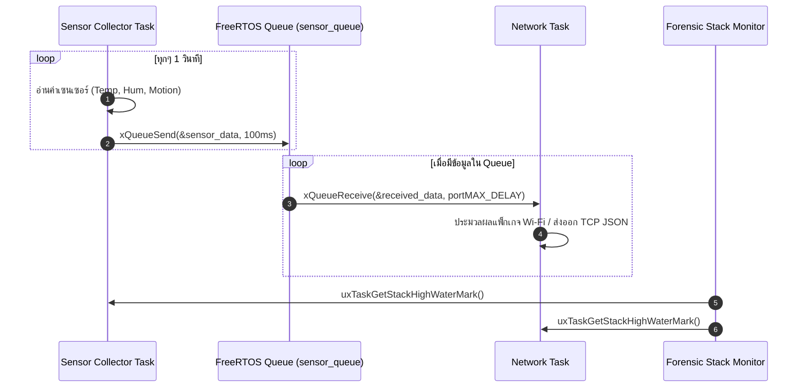

# ใบงานที่ 6.3: การออกแบบ FreeRTOS Task Architecture & Sensor Data Fusion ผ่าน Queue

## 0. กล่าวนำ (Introduction)
ในแอปพลิเคชัน IoT ระดับอุตสาหกรรม โปรแกรมเมอร์จะไม่เขียนโค้ดอ่านค่าเซนเซอร์และการรับส่งข้อมูล Wi-Fi รวมไว้ในฟังก์ชันเดียวกัน เพราะจะทำให้สแตกระบบเครือข่ายชะงัก (Network Latency & Blocking) 

ในใบงานนี้นักศึกษาจะได้ออกแบบสถาปัตยกรรม **FreeRTOS Multi-Tasking** โดยแยกโปรแกรมออกเป็น **Sensor Collector Task** และ **Network Communication Task** แล้วใช้ **FreeRTOS Queue** เป็นสะพานเชื่อมส่งผ่านโครงสร้างข้อมูล `sensor_data_t` อย่างปลอดภัย (Thread-Safe) พร้อมทั้งใช้คำสั่ง Forensic ตรวจวัดหน่วยความจำสแตก `uxTaskGetStackHighWaterMark()`

---

## 1. วัตถุประสงค์ (Objectives)
1. สามารถสร้างและบริหารจัดการ FreeRTOS Tasks บน ESP-IDF ด้วยฟังก์ชัน `xTaskCreate()` ได้
2. สามารถสร้างและใช้งาน FreeRTOS Queue (`xQueueCreate`, `xQueueSend`, `xQueueReceive`) ในการส่งผ่านข้อมูลได้
3. ป้องกันปัญหาการบล็อกระบบเครือข่าย Wi-Fi โดยการแยกงานอ่านเซนเซอร์ออกจาก Network Loop
4. ประเมินการใช้หน่วยความจำสแตกของแต่ละ Task ในสไตล์ Forensic ด้วย `uxTaskGetStackHighWaterMark()`

---

## 2. อุปกรณ์และซอฟต์แวร์ที่ใช้ในการทดลอง (Equipment & Tools)
1. บอร์ดไมโครคอนโทรลเลอร์ ESP32 จำนวน 1 บอร์ด
2. สายเชื่อมต่อ Micro-USB หรือ USB-C จำนวน 1 เส้น
3. โปรแกรม IDE เช่น VS Code พร้อม ESP-IDF Toolchain

---

## 3. สถาปัตยกรรมระบบ (System Architecture & Sequence)



---

## 4. ขั้นตอนการทดลอง (Experimental Procedures)

1. นำซอร์สโค้ดในข้อ 5 ไปวางในไฟล์ `main/main.c` ทำการ Build และ Flash ลงบอร์ด ESP32
2. สังเกต Forensic Log ใน Serial Monitor:
   - ตรวจดูข้อมูลที่ถูกส่งจาก `vSensorTask` เข้าสู่ Queue และถูกรับโดย `vNetworkTask`
   - ตรวจดูค่า **Stack High Water Mark** (ขนาดสแตกคงเหลือ) ของแต่ละ Task
3. ทดลองปรับขนาดสแตกของ `vSensorTask` ใน `xTaskCreate()` จาก `4096` ลดลงเหลือ `1024` สังเกตค่า High Water Mark และวิเคราะห์จุดเสี่ยง Stack Overflow

    - วิเคราะห์สิ่งที่เกิดขึ้น: เมื่อเราลดขนาด Stack ลงเหลือ 1024 ไบต์ พื้นที่ไม่เพียงพอให้ฟังก์ชันการทำงานภายใน Task (โดยเฉพาะฟังก์ชัน ESP_LOGI ซึ่งใช้หน่วยความจำสแตกค่อนข้างเยอะในการจัดรูปแบบข้อความ) ทำงานได้เสร็จสิ้น ส่งผลให้สแตกล้น (Stack Overflow) ไปทับหน่วยความจำส่วนอื่น ระบบปฏิบัติการ FreeRTOS ตรวจพบความผิดปกตินี้จึงสั่ง Panic Abort และ Reboot ระบบทันที เพื่อป้องกันความเสียหายของข้อมูล


---

## 5. ซอร์สโค้ดการทดลอง (Complete ESP-IDF Source Code - `main.c`)

```c
#include <stdio.h>
#include <string.h>
#include "freertos/FreeRTOS.h"
#include "freertos/task.h"
#include "freertos/queue.h"
#include "esp_system.h"
#include "esp_log.h"
#include "esp_random.h"

static const char *TAG = "LAB_FREERTOS_QUEUE";

// Sensor Data Structure
typedef struct {
    float temperature;
    float humidity;
    uint32_t light_lux;
    uint32_t timestamp_ms;
} sensor_data_t;

// Queue Handle
static QueueHandle_t xSensorQueue = NULL;

// ------------------------------------------------------------------
// Task 1: Sensor Collector Task (Simulates Reading Hardware Sensors)
// ------------------------------------------------------------------
void vSensorTask(void *pvParameters) {
    sensor_data_t data;
    ESP_LOGI(TAG, "[TASK CREATED]: Sensor Collector Task Started on Core %d", xPortGetCoreID());

    while (1) {
        // 1. Simulate reading sensors
        data.temperature = 25.0f + (esp_random() % 100) / 10.0f;
        data.humidity = 50.0f + (esp_random() % 200) / 10.0f;
        data.light_lux = 200 + (esp_random() % 500);
        data.timestamp_ms = xTaskGetTickCount() * portTICK_PERIOD_MS;

        ESP_LOGI(TAG, "[SENSOR TASK]: Pushing Data -> Temp: %.1f C, Hum: %.1f %%, Lux: %ld",
                 data.temperature, data.humidity, data.light_lux);

        // 2. Send data structure to FreeRTOS Queue
        if (xQueueSend(xSensorQueue, &data, pdMS_TO_TICKS(100)) != pdPASS) {
            ESP_LOGW(TAG, "[QUEUE WARNING]: Queue Full! Failed to push sensor data.");
        }

        // 3. Stack High Water Mark Check
        UBaseType_t hwm = uxTaskGetStackHighWaterMark(NULL);
        ESP_LOGI("FORENSIC_STACK", "  -> SensorTask Stack Remaining: %u words (%u bytes)",
                 hwm, hwm * sizeof(StackType_t));

        vTaskDelay(pdMS_TO_TICKS(1500));
    }
}

// ------------------------------------------------------------------
// Task 2: Network Task (Consumes Data from Queue for Wi-Fi Transmission)
// ------------------------------------------------------------------
void vNetworkTask(void *pvParameters) {
    sensor_data_t rx_data;
    ESP_LOGI(TAG, "[TASK CREATED]: Network Task Started on Core %d", xPortGetCoreID());

    while (1) {
        // Wait indefinitely for data from Queue
        if (xQueueReceive(xSensorQueue, &rx_data, portMAX_DELAY) == pdTRUE) {
            ESP_LOGI(TAG, "=======================================================");
            ESP_LOGI(TAG, "[NETWORK TASK]: Data Received from Queue!");
            ESP_LOGI(TAG, "  -> Timestamp   : %ld ms", rx_data.timestamp_ms);
            ESP_LOGI(TAG, "  -> Temperature : %.2f degC", rx_data.temperature);
            ESP_LOGI(TAG, "  -> Humidity    : %.2f %%", rx_data.humidity);
            ESP_LOGI(TAG, "  -> Light Lux   : %ld lux", rx_data.light_lux);
            ESP_LOGI(TAG, "[NETWORK TASK]: Preparing JSON Packet for Wi-Fi Transmission...");
            ESP_LOGI(TAG, "=======================================================");
        }

        UBaseType_t hwm = uxTaskGetStackHighWaterMark(NULL);
        ESP_LOGI("FORENSIC_STACK", "  -> NetworkTask Stack Remaining: %u words (%u bytes)",
                 hwm, hwm * sizeof(StackType_t));
    }
}

void app_main(void) {
    ESP_LOGI(TAG, "==================================================================");
    ESP_LOGI(TAG, "  Lab 6.3: FreeRTOS Multi-Tasking & Sensor Data Queue Fusion");
    ESP_LOGI(TAG, "==================================================================");

    // Create FreeRTOS Queue for 10 items of sensor_data_t
    xSensorQueue = xQueueCreate(10, sizeof(sensor_data_t));
    if (xSensorQueue == NULL) {
        ESP_LOGE(TAG, "Failed to create FreeRTOS Queue!");
        return;
    }

    // Create Tasks
    xTaskCreate(vSensorTask, "SensorCollectorTask", 3072, NULL, 5, NULL);
    xTaskCreate(vNetworkTask, "NetworkCommTask", 4096, NULL, 4, NULL);
}
```

---

## 6. ตารางบันทึกผลการทดลอง (Experiment Results)

### 6.1 บันทึกข้อมูล Forensic Stack High Water Mark

| ชื่อ FreeRTOS Task | ขนาด Stack ที่กำหนดใน `xTaskCreate` (Bytes) | ค่า High Water Mark ที่อ่านได้ (Words / Bytes) | สถานะความปลอดภัยสแตก |
| :--- | :---: | :---: | :---: |
| **`SensorCollectorTask`** | 3072 | 2028 words / 2028 bytes | ปลอดภัย (เหลือที่ว่างเพียงพอ) |
| **`NetworkCommTask`** | 4096 | 3080 words / 3080 bytes | ปลอดภัย (เหลือที่ว่างเพียงพอ) |

---

## 7. คำถามท้ายการทดลอง (Post-Lab Questions)

1. เหตุใดการใช้ **FreeRTOS Queue** จึงมีความปลอดภัย (Thread-Safe) มากกว่าการใช้ตัวแปรแบบ Global ในการรับส่งข้อมูลระหว่างสอง Task?
2. ค่า **Stack High Water Mark** มีประโยชน์อย่างไรในการตรวจวินิจฉัยปัญหาบั๊กในระบบเรียลไทม์ (RTOS)?
3. หาก `vSensorTask` ส่งข้อมูลเร็วมาก (เช่น ทุก 10ms) แต่ `vNetworkTask` ส่งข้อมูลออก Wi-Fi ได้ช้า (เช่น ใช้เวลา 500ms) จะเกิดอะไรขึ้นกับ Queue และระบบจะรับมืออย่างไร?

# สรุปคำถามท้ายการทดลอง (Post-Lab Questions)

1. เหตุใดการใช้ **FreeRTOS Queue** จึงมีความปลอดภัย (Thread-Safe) มากกว่าการใช้ตัวแปรแบบ Global ในการรับส่งข้อมูลระหว่างสอง Task?

**ตอบ:**
การใช้ FreeRTOS Queue มีความปลอดภัยและเป็น Thread-Safe มากกว่าการใช้ตัวแปร Global ด้วยเหตุผลดังนี้:
* **ป้องกันปัญหา Race Condition:** หากใช้ตัวแปร Global ธรรมดา เมื่อ Task หนึ่งกำลังเขียนข้อมูล (เช่น เขียนข้อมูลโครงสร้างเซนเซอร์ยังไม่ทันเสร็จครบทุกฟิลด์) และระบบสลับให้เกิด Context Switch ไปยังอีก Task เพื่อเข้ามาอ่านข้อมูลพอดี จะทำให้ได้ข้อมูลที่ผิดเพี้ยนหรือไม่สมบูรณ์ แต่ FreeRTOS Queue มีกลไกการจัดการเบื้องหลังที่รับประกันว่าการเขียนหรืออ่านข้อมูลจะเป็นการทำงานแบบเบ็ดเสร็จ (Atomic Operation) ทำให้ไม่มีใครมาแทรกแซงข้อมูลระหว่างทางได้
* **การจัดการสถานะของ Task อัตโนมัติ:** คิวมีการทำงานร่วมกับระบบจัดการคิวงานของ OS หากคิวว่าง Task ที่รอรับข้อมูลสามารถเข้าสู่สถานะหลับ (Blocked state) ได้ทันที ทำให้ไม่เปลืองทรัพยากร CPU ไปกับการวนลูปเช็คค่าตัวแปรแบบไร้ประโยชน์ (Busy waiting)

---

2. ค่า **Stack High Water Mark** มีประโยชน์อย่างไรในการตรวจวินิจฉัยปัญหาบั๊กในระบบเรียลไทม์ (RTOS)?

**ตอบ:**
ค่า Stack High Water Mark คือการตรวจสอบพื้นที่ว่างของหน่วยความจำสแตก (Stack) ที่ **"เหลือน้อยที่สุด"** นับตั้งแต่เริ่มรัน Task นั้นๆ ซึ่งมีประโยชน์อย่างมากในการวินิจฉัยและออกแบบระบบ:
* **ตรวจจับความเสี่ยง Stack Overflow ล่วงหน้า:** หากค่านี้เข้าใกล้ 0 แสดงว่า Task นั้นกินพื้นที่สแตกลึกมากและเสี่ยงที่หน่วยความจำจะล้นไปทับส่วนอื่นจนระบบ Crash ทำให้โปรแกรมเมอร์รู้ว่าต้องไปเพิ่มขนาดสแตกให้ Task นั้น
* **การทำ Memory Optimization:** ไมโครคอนโทรลเลอร์มีทรัพยากร RAM จำกัด หากประเมินแล้วพบว่าค่า High Water Mark เหลือพื้นที่ว่างมากเกินไป (Allocate ไว้เยอะเกิน) โปรแกรมเมอร์ก็สามารถปรับลดขนาดของสแตกตอนสร้าง Task ลงได้ เพื่อดึง RAM กลับมาให้ระบบหรือ Task อื่นนำไปใช้งาน

---

3. หาก `vSensorTask` ส่งข้อมูลเร็วมาก (เช่น ทุก 10ms) แต่ `vNetworkTask` ส่งข้อมูลออก Wi-Fi ได้ช้า (เช่น ใช้เวลา 500ms) จะเกิดอะไรขึ้นกับ Queue และระบบจะรับมืออย่างไร?

**ตอบ:**
เหตุการณ์นี้คือปัญหาความเร็วที่ไม่สัมพันธ์กัน (Producer-Consumer Mismatch) ซึ่งจะส่งผลต่อระบบดังนี้:
* **สิ่งที่เกิดขึ้นกับ Queue:** ข้อมูลถูกผลิตนำเข้าเร็วกว่าถูกดึงออกไปประมวลผล ทำให้ Queue (ซึ่งมีขนาดจำกัด เช่น 10 ช่อง) เต็มอย่างรวดเร็ว (Queue Full)
* **การรับมือของระบบ:** เมื่อคิวเต็ม คำสั่ง `xQueueSend()` ที่อยู่ใน `vSensorTask` จะไม่สามารถส่งข้อมูลเข้าคิวได้ทันที หากมีการตั้งเวลาหน่วง (Timeout) ไว้ Task ก็จะรอคอยตามเวลา หากหมดเวลาแล้วคิวยังไม่ว่าง คำสั่งนั้นจะล้มเหลว และข้อมูลเซนเซอร์ชุดใหม่ล่าสุดนั้นจะถูก **ดร็อปทิ้งไป (Data Loss)**
* **ผลลัพธ์โดยรวม:** แม้ข้อมูลบางส่วนจะสูญหาย แต่กลไกนี้ช่วยให้ `vSensorTask` ไม่ถูกล็อกตาย (Deadlock) และสามารถวนลูปกลับไปทำงานอ่านค่าเซนเซอร์รอบต่อไปได้ตามปกติ ทำให้สถาปัตยกรรมระบบโดยรวมยังคงมีเสถียรภาพและไม่ Crash

ค่าที่ได้
```
entry 0x40080644
--- 0x40080644: call_start_cpu0 at /Users/tanwat/.espressif/v6.0.2/esp-idf/components/bootloader/subproject/main/bootloader_start.c:27
I (27) boot: ESP-IDF v6.0.2 2nd stage bootloader
I (27) boot: compile time Aug 11 2026 10:23:26
I (28) boot: Multicore bootloader
I (29) boot: chip revision: v3.1
I (32) boot.esp32: SPI Speed      : 40MHz
I (35) boot.esp32: SPI Mode       : DIO
I (39) boot.esp32: SPI Flash Size : 2MB
I (42) boot: Enabling RNG early entropy source...
I (47) boot: Partition Table:
I (49) boot: ## Label            Usage          Type ST Offset   Length
I (56) boot:  0 nvs              WiFi data        01 02 00009000 00006000
I (62) boot:  1 phy_init         RF data          01 01 0000f000 00001000
I (69) boot:  2 factory          factory app      00 00 00010000 00100000
I (75) boot: End of partition table
I (79) esp_image: segment 0: paddr=00010020 vaddr=3f400020 size=08938h ( 35128) map
I (99) esp_image: segment 1: paddr=00018960 vaddr=3ffb0000 size=029fch ( 10748) load
I (103) esp_image: segment 2: paddr=0001b364 vaddr=40080000 size=04cb4h ( 19636) load
I (111) esp_image: segment 3: paddr=00020020 vaddr=400d0020 size=0c3b0h ( 50096) map
I (130) esp_image: segment 4: paddr=0002c3d8 vaddr=40084cb4 size=05fe4h ( 24548) load
I (140) esp_image: segment 5: paddr=000323c4 vaddr=50000000 size=00028h (    40) load
I (146) boot: Loaded app from partition at offset 0x10000
I (146) boot: Disabling RNG early entropy source...
I (158) cpu_start: Multicore app
I (166) cpu_start: GPIO 3 and 1 are used as console UART I/O pins
I (167) cpu_start: Pro cpu start user code
I (167) cpu_start: cpu freq: 160000000 Hz
I (168) app_init: Application information:
I (172) app_init: Project name:     freertos_sensor_queue
I (177) app_init: App version:      029da6d-dirty
I (182) app_init: Compile time:     Aug 11 2026 10:23:21
I (187) app_init: ELF file SHA256:  2ef800037...
I (191) app_init: ESP-IDF:          v6.0.2
I (195) efuse_init: Min chip rev:     v0.0
I (199) efuse_init: Max chip rev:     v3.99 
I (203) efuse_init: Chip rev:         v3.1
I (207) heap_init: Initializing. RAM available for dynamic allocation:
I (213) heap_init: At 3FFAE6E0 len 00001920 (6 KiB): DRAM
I (218) heap_init: At 3FFB33A8 len 0002CC58 (179 KiB): DRAM
I (223) heap_init: At 3FFE0440 len 00003AE0 (14 KiB): D/IRAM
I (229) heap_init: At 3FFE4350 len 0001BCB0 (111 KiB): D/IRAM
I (234) heap_init: At 4008AC98 len 00015368 (84 KiB): IRAM
I (241) spi_flash: detected chip: generic
I (243) spi_flash: flash io: dio
W (246) spi_flash: Detected size(4096k) larger than the size in the binary image header(2048k). Using the size in the binary image header.
I (259) main_task: Started on CPU0
I (259) main_task: Calling app_main()
I (259) LAB_FREERTOS_QUEUE: ==================================================================
I (269) LAB_FREERTOS_QUEUE:   Lab 6.3: FreeRTOS Multi-Tasking & Sensor Data Queue Fusion
I (279) LAB_FREERTOS_QUEUE: ==================================================================
I (279) LAB_FREERTOS_QUEUE: [TASK CREATED]: Sensor Collector Task Started on Core 0
I (289) LAB_FREERTOS_QUEUE: [SENSOR TASK]: Pushing Data -> Temp: 31.4 C, Hum: 68.0 %, Lux: 584
I (299) FORENSIC_STACK:   -> SensorTask Stack Remaining: 2028 words (2028 bytes)
I (309) LAB_FREERTOS_QUEUE: [TASK CREATED]: Network Task Started on Core 0
I (309) LAB_FREERTOS_QUEUE: =======================================================
I (319) LAB_FREERTOS_QUEUE: [NETWORK TASK]: Data Received from Queue!
I (329) LAB_FREERTOS_QUEUE:   -> Timestamp   : 30 ms
I (329) LAB_FREERTOS_QUEUE:   -> Temperature : 31.40 degC
I (339) LAB_FREERTOS_QUEUE:   -> Humidity    : 68.00 %
I (339) LAB_FREERTOS_QUEUE:   -> Light Lux   : 584 lux
I (349) LAB_FREERTOS_QUEUE: [NETWORK TASK]: Preparing JSON Packet for Wi-Fi Transmission...
I (359) LAB_FREERTOS_QUEUE: =======================================================
I (359) FORENSIC_STACK:   -> NetworkTask Stack Remaining: 3080 words (3080 bytes)
I (369) main_task: Returned from app_main()
I (1809) LAB_FREERTOS_QUEUE: [SENSOR TASK]: Pushing Data -> Temp: 31.6 C, Hum: 50.2 %, Lux: 361
I (1809) FORENSIC_STACK:   -> SensorTask Stack Remaining: 2028 words (2028 bytes)
I (1809) LAB_FREERTOS_QUEUE: =======================================================
I (1819) LAB_FREERTOS_QUEUE: [NETWORK TASK]: Data Received from Queue!
I (1819) LAB_FREERTOS_QUEUE:   -> Timestamp   : 1550 ms
I (1829) LAB_FREERTOS_QUEUE:   -> Temperature : 31.60 degC
I (1829) LAB_FREERTOS_QUEUE:   -> Humidity    : 50.20 %
I (1839) LAB_FREERTOS_QUEUE:   -> Light Lux   : 361 lux
I (1839) LAB_FREERTOS_QUEUE: [NETWORK TASK]: Preparing JSON Packet for Wi-Fi Transmission...
I (1849) LAB_FREERTOS_QUEUE: =======================================================
I (1859) FORENSIC_STACK:   -> NetworkTask Stack Remaining: 3080 words (3080 bytes)
I (3309) LAB_FREERTOS_QUEUE: [SENSOR TASK]: Pushing Data -> Temp: 33.4 C, Hum: 62.7 %, Lux: 656
I (3309) LAB_FREERTOS_QUEUE: =======================================================
I (3309) FORENSIC_STACK:   -> SensorTask Stack Remaining: 2028 words (2028 bytes)
I (3309) LAB_FREERTOS_QUEUE: [NETWORK TASK]: Data Received from Queue!
I (3319) LAB_FREERTOS_QUEUE:   -> Timestamp   : 3050 ms
I (3329) LAB_FREERTOS_QUEUE:   -> Temperature : 33.40 degC
I (3329) LAB_FREERTOS_QUEUE:   -> Humidity    : 62.70 %
I (3339) LAB_FREERTOS_QUEUE:   -> Light Lux   : 656 lux
I (3339) LAB_FREERTOS_QUEUE: [NETWORK TASK]: Preparing JSON Packet for Wi-Fi Transmission...
I (3349) LAB_FREERTOS_QUEUE: =======================================================
I (3359) FORENSIC_STACK:   -> NetworkTask Stack Remaining: 3080 words (3080 bytes)
I (4819) LAB_FREERTOS_QUEUE: [SENSOR TASK]: Pushing Data -> Temp: 25.7 C, Hum: 63.5 %, Lux: 612
I (4819) LAB_FREERTOS_QUEUE: =======================================================
I (4819) FORENSIC_STACK:   -> SensorTask Stack Remaining: 2028 words (2028 bytes)
I (4819) LAB_FREERTOS_QUEUE: [NETWORK TASK]: Data Received from Queue!
I (4829) LAB_FREERTOS_QUEUE:   -> Timestamp   : 4560 ms
I (4839) LAB_FREERTOS_QUEUE:   -> Temperature : 25.70 degC
I (4839) LAB_FREERTOS_QUEUE:   -> Humidity    : 63.50 %
I (4849) LAB_FREERTOS_QUEUE:   -> Light Lux   : 612 lux
I (4849) LAB_FREERTOS_QUEUE: [NETWORK TASK]: Preparing JSON Packet for Wi-Fi Transmission...
I (4859) LAB_FREERTOS_QUEUE: =======================================================
I (4869) FORENSIC_STACK:   -> NetworkTask Stack Remaining: 3080 words (3080 bytes)
I (6329) LAB_FREERTOS_QUEUE: [SENSOR TASK]: Pushing Data -> Temp: 27.0 C, Hum: 60.2 %, Lux: 354
I (6329) LAB_FREERTOS_QUEUE: =======================================================
I (6329) FORENSIC_STACK:   -> SensorTask Stack Remaining: 2028 words (2028 bytes)
I (6329) LAB_FREERTOS_QUEUE: [NETWORK TASK]: Data Received from Queue!
I (6339) LAB_FREERTOS_QUEUE:   -> Timestamp   : 6070 ms
I (6349) LAB_FREERTOS_QUEUE:   -> Temperature : 27.00 degC
I (6349) LAB_FREERTOS_QUEUE:   -> Humidity    : 60.20 %
I (6359) LAB_FREERTOS_QUEUE:   -> Light Lux   : 354 lux
I (6359) LAB_FREERTOS_QUEUE: [NETWORK TASK]: Preparing JSON Packet for Wi-Fi Transmission...
I (6369) LAB_FREERTOS_QUEUE: =======================================================
I (6379) FORENSIC_STACK:   -> NetworkTask Stack Remaining: 3080 words (3080 bytes)
I (7839) LAB_FREERTOS_QUEUE: [SENSOR TASK]: Pushing Data -> Temp: 34.1 C, Hum: 52.7 %, Lux: 348
I (7839) LAB_FREERTOS_QUEUE: =======================================================
I (7839) FORENSIC_STACK:   -> SensorTask Stack Remaining: 2028 words (2028 bytes)
I (7839) LAB_FREERTOS_QUEUE: [NETWORK TASK]: Data Received from Queue!
I (7849) LAB_FREERTOS_QUEUE:   -> Timestamp   : 7580 ms
I (7859) LAB_FREERTOS_QUEUE:   -> Temperature : 34.10 degC
I (7859) LAB_FREERTOS_QUEUE:   -> Humidity    : 52.70 %
I (7869) LAB_FREERTOS_QUEUE:   -> Light Lux   : 348 lux
I (7869) LAB_FREERTOS_QUEUE: [NETWORK TASK]: Preparing JSON Packet for Wi-Fi Transmission...
I (7879) LAB_FREERTOS_QUEUE: =======================================================
I (7889) FORENSIC_STACK:   -> NetworkTask Stack Remaining: 3080 words (3080 bytes)
I (9349) LAB_FREERTOS_QUEUE: [SENSOR TASK]: Pushing Data -> Temp: 25.1 C, Hum: 54.0 %, Lux: 241
I (9349) LAB_FREERTOS_QUEUE: =======================================================
I (9349) FORENSIC_STACK:   -> SensorTask Stack Remaining: 2028 words (2028 bytes)
I (9349) LAB_FREERTOS_QUEUE: [NETWORK TASK]: Data Received from Queue!
I (9359) LAB_FREERTOS_QUEUE:   -> Timestamp   : 9090 ms
I (9369) LAB_FREERTOS_QUEUE:   -> Temperature : 25.10 degC
I (9369) LAB_FREERTOS_QUEUE:   -> Humidity    : 54.00 %
I (9379) LAB_FREERTOS_QUEUE:   -> Light Lux   : 241 lux
I (9379) LAB_FREERTOS_QUEUE: [NETWORK TASK]: Preparing JSON Packet for Wi-Fi Transmission...
I (9389) LAB_FREERTOS_QUEUE: =======================================================
I (9399) FORENSIC_STACK:   -> NetworkTask Stack Remaining: 3080 words (3080 bytes)
I (10859) LAB_FREERTOS_QUEUE: [SENSOR TASK]: Pushing Data -> Temp: 26.9 C, Hum: 58.0 %, Lux: 267
I (10859) LAB_FREERTOS_QUEUE: =======================================================
I (10859) FORENSIC_STACK:   -> SensorTask Stack Remaining: 2028 words (2028 bytes)
I (10859) LAB_FREERTOS_QUEUE: [NETWORK TASK]: Data Received from Queue!
I (10869) LAB_FREERTOS_QUEUE:   -> Timestamp   : 10600 ms
I (10879) LAB_FREERTOS_QUEUE:   -> Temperature : 26.90 degC
I (10879) LAB_FREERTOS_QUEUE:   -> Humidity    : 58.00 %
I (10889) LAB_FREERTOS_QUEUE:   -> Light Lux   : 267 lux
I (10889) LAB_FREERTOS_QUEUE: [NETWORK TASK]: Preparing JSON Packet for Wi-Fi Transmission...
I (10899) LAB_FREERTOS_QUEUE: =======================================================
I (10909) FORENSIC_STACK:   -> NetworkTask Stack Remaining: 3080 words (3080 bytes)
I (12369) LAB_FREERTOS_QUEUE: [SENSOR TASK]: Pushing Data -> Temp: 25.9 C, Hum: 55.8 %, Lux: 424
I (12369) LAB_FREERTOS_QUEUE: =======================================================
I (12369) FORENSIC_STACK:   -> SensorTask Stack Remaining: 2028 words (2028 bytes)
I (12369) LAB_FREERTOS_QUEUE: [NETWORK TASK]: Data Received from Queue!
I (12379) LAB_FREERTOS_QUEUE:   -> Timestamp   : 12110 ms
I (12389) LAB_FREERTOS_QUEUE:   -> Temperature : 25.90 degC
I (12389) LAB_FREERTOS_QUEUE:   -> Humidity    : 55.80 %
I (12399) LAB_FREERTOS_QUEUE:   -> Light Lux   : 424 lux
I (12399) LAB_FREERTOS_QUEUE: [NETWORK TASK]: Preparing JSON Packet for Wi-Fi Transmission...
I (12409) LAB_FREERTOS_QUEUE: =======================================================
I (12419) FORENSIC_STACK:   -> NetworkTask Stack Remaining: 3080 words (3080 bytes)
I (13879) LAB_FREERTOS_QUEUE: [SENSOR TASK]: Pushing Data -> Temp: 33.1 C, Hum: 63.6 %, Lux: 395
I (13879) LAB_FREERTOS_QUEUE: =======================================================
I (13879) FORENSIC_STACK:   -> SensorTask Stack Remaining: 2028 words (2028 bytes)
I (13879) LAB_FREERTOS_QUEUE: [NETWORK TASK]: Data Received from Queue!
I (13889) LAB_FREERTOS_QUEUE:   -> Timestamp   : 13620 ms
I (13899) LAB_FREERTOS_QUEUE:   -> Temperature : 33.10 degC
I (13899) LAB_FREERTOS_QUEUE:   -> Humidity    : 63.60 %
I (13909) LAB_FREERTOS_QUEUE:   -> Light Lux   : 395 lux
I (13909) LAB_FREERTOS_QUEUE: [NETWORK TASK]: Preparing JSON Packet for Wi-Fi Transmission...
I (13919) LAB_FREERTOS_QUEUE: =======================================================
I (13929) FORENSIC_STACK:   -> NetworkTask Stack Remaining: 3080 words (3080 bytes)
I (15389) LAB_FREERTOS_QUEUE: [SENSOR TASK]: Pushing Data -> Temp: 31.3 C, Hum: 59.6 %, Lux: 582
I (15389) LAB_FREERTOS_QUEUE: =======================================================
I (15389) FORENSIC_STACK:   -> SensorTask Stack Remaining: 2028 words (2028 bytes)
I (15389) LAB_FREERTOS_QUEUE: [NETWORK TASK]: Data Received from Queue!
I (15399) LAB_FREERTOS_QUEUE:   -> Timestamp   : 15130 ms
I (15409) LAB_FREERTOS_QUEUE:   -> Temperature : 31.30 degC
I (15409) LAB_FREERTOS_QUEUE:   -> Humidity    : 59.60 %
I (15419) LAB_FREERTOS_QUEUE:   -> Light Lux   : 582 lux
I (15419) LAB_FREERTOS_QUEUE: [NETWORK TASK]: Preparing JSON Packet for Wi-Fi Transmission...
I (15429) LAB_FREERTOS_QUEUE: =======================================================
I (15439) FORENSIC_STACK:   -> NetworkTask Stack Remaining: 3080 words (3080 bytes)
I (16899) LAB_FREERTOS_QUEUE: [SENSOR TASK]: Pushing Data -> Temp: 25.4 C, Hum: 55.5 %, Lux: 324
I (16899) LAB_FREERTOS_QUEUE: =======================================================
I (16899) FORENSIC_STACK:   -> SensorTask Stack Remaining: 2028 words (2028 bytes)
I (16899) LAB_FREERTOS_QUEUE: [NETWORK TASK]: Data Received from Queue!
I (16909) LAB_FREERTOS_QUEUE:   -> Timestamp   : 16640 ms
I (16919) LAB_FREERTOS_QUEUE:   -> Temperature : 25.40 degC
I (16919) LAB_FREERTOS_QUEUE:   -> Humidity    : 55.50 %
I (16929) LAB_FREERTOS_QUEUE:   -> Light Lux   : 324 lux
I (16929) LAB_FREERTOS_QUEUE: [NETWORK TASK]: Preparing JSON Packet for Wi-Fi Transmission...
I (16939) LAB_FREERTOS_QUEUE: =======================================================
I (16949) FORENSIC_STACK:   -> NetworkTask Stack Remaining: 3080 words (3080 bytes)
I (18409) LAB_FREERTOS_QUEUE: [SENSOR TASK]: Pushing Data -> Temp: 33.8 C, Hum: 51.8 %, Lux: 445
I (18409) LAB_FREERTOS_QUEUE: =======================================================
I (18409) FORENSIC_STACK:   -> SensorTask Stack Remaining: 2028 words (2028 bytes)
I (18409) LAB_FREERTOS_QUEUE: [NETWORK TASK]: Data Received from Queue!
I (18419) LAB_FREERTOS_QUEUE:   -> Timestamp   : 18150 ms
I (18429) LAB_FREERTOS_QUEUE:   -> Temperature : 33.80 degC
I (18429) LAB_FREERTOS_QUEUE:   -> Humidity    : 51.80 %
I (18439) LAB_FREERTOS_QUEUE:   -> Light Lux   : 445 lux
I (18439) LAB_FREERTOS_QUEUE: [NETWORK TASK]: Preparing JSON Packet for Wi-Fi Transmission...
I (18449) LAB_FREERTOS_QUEUE: =======================================================
I (18459) FORENSIC_STACK:   -> NetworkTask Stack Remaining: 3080 words (3080 bytes)
I (19919) LAB_FREERTOS_QUEUE: [SENSOR TASK]: Pushing Data -> Temp: 32.9 C, Hum: 62.5 %, Lux: 600
I (19919) LAB_FREERTOS_QUEUE: =======================================================
I (19919) FORENSIC_STACK:   -> SensorTask Stack Remaining: 2028 words (2028 bytes)
I (19919) LAB_FREERTOS_QUEUE: [NETWORK TASK]: Data Received from Queue!
I (19929) LAB_FREERTOS_QUEUE:   -> Timestamp   : 19660 ms
I (19939) LAB_FREERTOS_QUEUE:   -> Temperature : 32.90 degC
I (19939) LAB_FREERTOS_QUEUE:   -> Humidity    : 62.50 %
I (19949) LAB_FREERTOS_QUEUE:   -> Light Lux   : 600 lux
I (19949) LAB_FREERTOS_QUEUE: [NETWORK TASK]: Preparing JSON Packet for Wi-Fi Transmission...
I (19959) LAB_FREERTOS_QUEUE: =======================================================
I (19969) FORENSIC_STACK:   -> NetworkTask Stack Remaining: 3080 words (3080 bytes)
I (21429) LAB_FREERTOS_QUEUE: [SENSOR TASK]: Pushing Data -> Temp: 29.1 C, Hum: 69.7 %, Lux: 649
I (21429) LAB_FREERTOS_QUEUE: =======================================================
I (21429) FORENSIC_STACK:   -> SensorTask Stack Remaining: 2028 words (2028 bytes)
I (21429) LAB_FREERTOS_QUEUE: [NETWORK TASK]: Data Received from Queue!
I (21439) LAB_FREERTOS_QUEUE:   -> Timestamp   : 21170 ms
I (21449) LAB_FREERTOS_QUEUE:   -> Temperature : 29.10 degC
I (21449) LAB_FREERTOS_QUEUE:   -> Humidity    : 69.70 %
I (21459) LAB_FREERTOS_QUEUE:   -> Light Lux   : 649 lux
I (21459) LAB_FREERTOS_QUEUE: [NETWORK TASK]: Preparing JSON Packet for Wi-Fi Transmission...
I (21469) LAB_FREERTOS_QUEUE: =======================================================
I (21479) FORENSIC_STACK:   -> NetworkTask Stack Remaining: 3080 words (3080 bytes)
I (22939) LAB_FREERTOS_QUEUE: [SENSOR TASK]: Pushing Data -> Temp: 30.2 C, Hum: 54.4 %, Lux: 394
I (22939) LAB_FREERTOS_QUEUE: =======================================================
I (22939) FORENSIC_STACK:   -> SensorTask Stack Remaining: 2028 words (2028 bytes)
I (22939) LAB_FREERTOS_QUEUE: [NETWORK TASK]: Data Received from Queue!
I (22949) LAB_FREERTOS_QUEUE:   -> Timestamp   : 22680 ms
I (22959) LAB_FREERTOS_QUEUE:   -> Temperature : 30.20 degC
I (22959) LAB_FREERTOS_QUEUE:   -> Humidity    : 54.40 %
I (22969) LAB_FREERTOS_QUEUE:   -> Light Lux   : 394 lux
I (22969) LAB_FREERTOS_QUEUE: [NETWORK TASK]: Preparing JSON Packet for Wi-Fi Transmission...
I (22979) LAB_FREERTOS_QUEUE: =======================================================
I (22989) FORENSIC_STACK:   -> NetworkTask Stack Remaining: 3080 words (3080 bytes)
I (24449) LAB_FREERTOS_QUEUE: [SENSOR TASK]: Pushing Data -> Temp: 33.1 C, Hum: 54.4 %, Lux: 592
I (24449) LAB_FREERTOS_QUEUE: =======================================================
I (24449) FORENSIC_STACK:   -> SensorTask Stack Remaining: 2028 words (2028 bytes)
I (24449) LAB_FREERTOS_QUEUE: [NETWORK TASK]: Data Received from Queue!
I (24459) LAB_FREERTOS_QUEUE:   -> Timestamp   : 24190 ms
I (24469) LAB_FREERTOS_QUEUE:   -> Temperature : 33.10 degC
I (24469) LAB_FREERTOS_QUEUE:   -> Humidity    : 54.40 %
I (24479) LAB_FREERTOS_QUEUE:   -> Light Lux   : 592 lux
I (24479) LAB_FREERTOS_QUEUE: [NETWORK TASK]: Preparing JSON Packet for Wi-Fi Transmission...
I (24489) LAB_FREERTOS_QUEUE: =======================================================
I (24499) FORENSIC_STACK:   -> NetworkTask Stack Remaining: 3080 words (3080 bytes)
I (25959) LAB_FREERTOS_QUEUE: [SENSOR TASK]: Pushing Data -> Temp: 32.9 C, Hum: 68.0 %, Lux: 493
I (25959) LAB_FREERTOS_QUEUE: =======================================================
I (25959) FORENSIC_STACK:   -> SensorTask Stack Remaining: 2028 words (2028 bytes)
I (25959) LAB_FREERTOS_QUEUE: [NETWORK TASK]: Data Received from Queue!
I (25969) LAB_FREERTOS_QUEUE:   -> Timestamp   : 25700 ms
I (25979) LAB_FREERTOS_QUEUE:   -> Temperature : 32.90 degC
I (25979) LAB_FREERTOS_QUEUE:   -> Humidity    : 68.00 %
I (25989) LAB_FREERTOS_QUEUE:   -> Light Lux   : 493 lux
I (25989) LAB_FREERTOS_QUEUE: [NETWORK TASK]: Preparing JSON Packet for Wi-Fi Transmission...
I (25999) LAB_FREERTOS_QUEUE: =======================================================
```