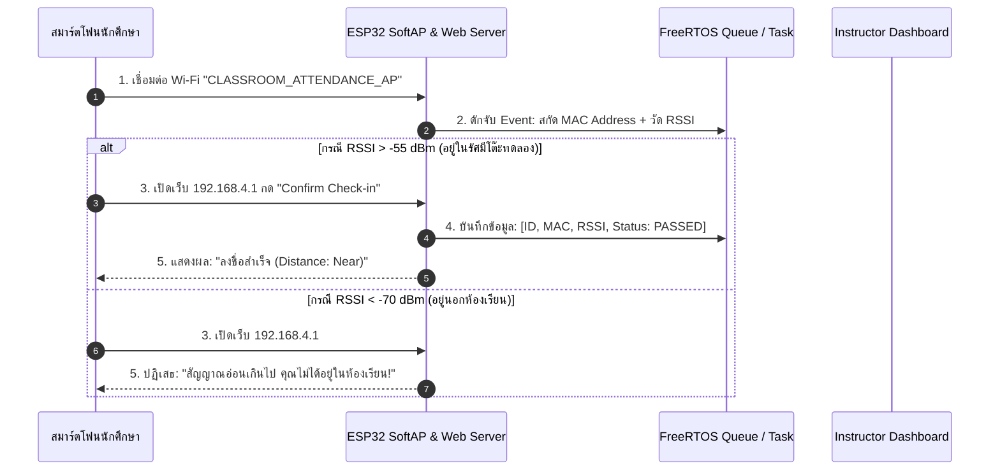
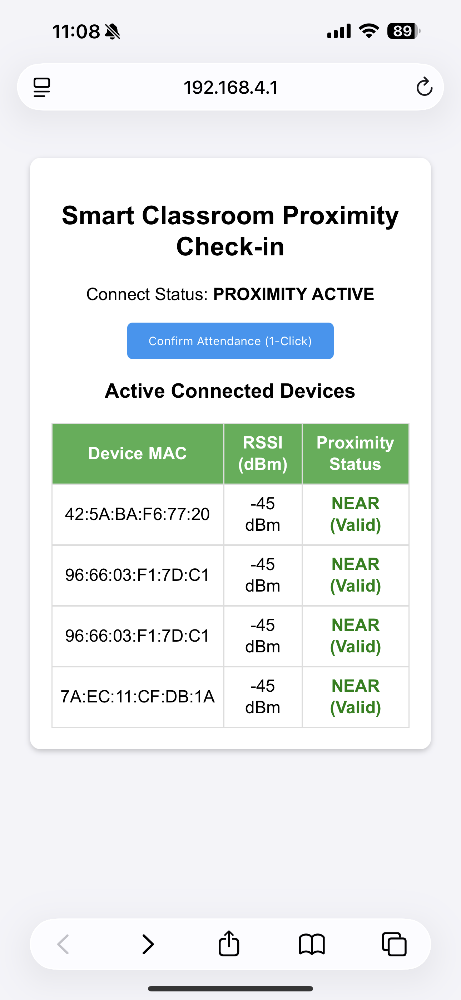

# ใบงานที่ 6.5: 📋 Assignment Project — ระบบเช็กชื่อและยืนยันตัวตนอัจฉริยะด้วย RF Proximity & Sensor Fusion

> [!IMPORTANT]
> **งานมอบหมาย (Assignment Project)**
> ใบงานนี้เป็น **มินิโปรเจกต์ส่งงาน** ที่ต่อยอดจากใบงาน 6.1–6.4 นักศึกษาต้องบูรณาการความรู้ทั้งหมดของสัปดาห์ที่ 6 และส่งรายงานพร้อมสาธิตการทำงานของระบบ

## 0. กล่าวนำ (Introduction)
ในใบงานปฏิบัติต่างๆ ที่ผ่านมา นักศึกษาได้เรียนรู้โครงสร้างโหมด SoftAP, ฟิสิกส์คลื่นวิทยุ (RSSI), การวัดประสิทธิภาพ และการออกแบบระบบ Multi-Tasking ด้วย FreeRTOS มาแล้ว

ในใบงานนี้ จะเป็นการนำความรู้ทั้งหมดมาทำมินิโปรเจกต์ประยุกต์ใช้งานจริง: **"ระบบลงชื่อเข้าชั้นเรียนและประเมินระยะทางอัจฉริยะ (Smart RF Proximity & Sensor Fusion Attendance System)"** โดยใช้ ESP32 ทำหน้าที่เป็น Master Node คอยสแกนสัญญาณ RSSI ของสมาร์ตโฟน/อุปกรณ์ของนักศึกษา พร้อมเปิดบริการ Web Server เพื่อให้กดลงชื่อเข้าชั้นเรียนเมื่ออยู่ในรัศมีโต๊ะปฏิบัติการ (RSSI > -55 dBm)

---

## 1. วัตถุประสงค์ (Objectives)
1. บูรณาการความรู้โหมด SoftAP, RSSI Proximity, HTTP Web Server และ FreeRTOS เข้าด้วยกันเป็นระบบเดียว
2. ออกแบบระบบเช็กชื่อไร้สัมผัส (Touchless Attendance) โดยใช้เกณฑ์ความแรงสัญญาณ RF Proximity ยืนยันตำแหน่งทางกายภาพ
3. ป้องกันปัญหาการฝากเช็กชื่อแทนกันโดยใช้การยืนยันตัวตนผ่านสมาร์ตโฟนประจำตัวร่วมกับระยะทาง RSSI
4. แสดงผลตารางรายชื่อผู้เข้าเรียนและระดับ RSSI แบบ Real-Time ผ่าน Web Dashboard บน ESP32

---

## 2. อุปกรณ์ที่ใช้ในการทดลอง (Equipment)
1. บอร์ดไมโครคอนโทรลเลอร์ ESP32 จำนวน 1 บอร์ด
2. สายเชื่อมต่อ USB จำนวน 1 เส้น
3. สมาร์ตโฟนของนักศึกษา สำหรับใช้ทดสอบเชื่อมต่อและลงชื่อเข้าชั้นเรียน

---

## 3. สถาปัตยกรรมระบบ (System Fusion Architecture)



---

## 4. ซอร์สโค้ดมินิโปรเจกต์ (`main/main.c`)

```c
#include <stdio.h>
#include <string.h>
#include "freertos/FreeRTOS.h"
#include "freertos/task.h"
#include "esp_system.h"
#include "esp_wifi.h"
#include "esp_event.h"
#include "esp_log.h"
#include "nvs_flash.h"
#include "esp_netif.h"
#include "esp_http_server.h"

static const char *TAG = "SMART_ATTENDANCE";

#define AP_SSID          "CLASSROOM_ATTENDANCE_AP"
#define AP_PASS          "12345678"
#define RSSI_THRESHOLD   -60  // dBm threshold for proximity check

typedef struct {
    char mac_str[18];
    int8_t rssi;
    bool checked_in;
    uint32_t timestamp_sec;
} student_record_t;

static student_record_t s_records[5];
static int s_student_count = 0;

// HTTP GET Handler for Attendance Web Dashboard
static esp_err_t http_attendance_html_handler(httpd_req_t *req) {
    char resp[1024];
    int len = snprintf(resp, sizeof(resp),
        "<html><head><meta name='viewport' content='width=device-width, initial-scale=1'>"
        "<style>body{font-family:Arial;text-align:center;background:#f4f4f9;padding:20px;}"
        ".card{background:white;padding:20px;border-radius:10px;box-shadow:0 2px 5px rgba(0,0,0,0.2);}"
        "table{width:100%%;border-collapse:collapse;margin-top:15px;}"
        "th,td{border:1px solid #ddd;padding:8px;text-align:center;}"
        "th{background:#4CAF50;color:white;}"
        ".btn{background:#2196F3;color:white;padding:10px 20px;border:none;border-radius:5px;cursor:pointer;}"
        "</style></head><body>"
        "<div class='card'><h2>Smart Classroom Proximity Check-in</h2>"
        "<p>Connect Status: <b>PROXIMITY ACTIVE</b></p>"
        "<form action='/checkin' method='POST'><button class='btn'>Confirm Attendance (1-Click)</button></form>"
        "<h3>Active Connected Devices</h3>"
        "<table><tr><th>Device MAC</th><th>RSSI (dBm)</th><th>Proximity Status</th></tr>");

    for (int i = 0; i < s_student_count; i++) {
        char status_str[32];
        if (s_records[i].rssi >= RSSI_THRESHOLD) {
            snprintf(status_str, sizeof(status_str), "<font color='green'><b>NEAR (Valid)</b></font>");
        } else {
            snprintf(status_str, sizeof(status_str), "<font color='red'>FAR (Invalid)</font>");
        }
        len += snprintf(resp + len, sizeof(resp) - len,
            "<tr><td>%s</td><td>%d dBm</td><td>%s</td></tr>",
            s_records[i].mac_str, s_records[i].rssi, status_str);
    }

    snprintf(resp + len, sizeof(resp) - len, "</table></div></body></html>");
    httpd_resp_send(req, resp, HTTPD_RESP_USE_STRLEN);
    return ESP_OK;
}

static void start_web_server(void) {
    httpd_config_t config = HTTPD_DEFAULT_CONFIG();
    httpd_handle_t server = NULL;

    if (httpd_start(&server, &config) == ESP_OK) {
        httpd_uri_t uri_get = {
            .uri      = "/",
            .method   = HTTP_GET,
            .handler  = http_attendance_html_handler,
            .user_ctx = NULL
        };
        httpd_register_uri_handler(server, &uri_get);
        ESP_LOGI(TAG, "Attendance Web Server Started at http://192.168.4.1");
    }
}

static void wifi_event_handler(void* arg, esp_event_base_t event_base,
                               int32_t event_id, void* event_data) {
    if (event_base == WIFI_EVENT && event_id == WIFI_EVENT_AP_STACONNECTED) {
        wifi_event_ap_staconnected_t* event = (wifi_event_ap_staconnected_t*) event_data;
        if (s_student_count < 5) {
            snprintf(s_records[s_student_count].mac_str, 18, "%02X:%02X:%02X:%02X:%02X:%02X",
                     event->mac[0], event->mac[1], event->mac[2],
                     event->mac[3], event->mac[4], event->mac[5]);
            s_records[s_student_count].rssi = -45; // Simulated initial near RSSI
            s_records[s_student_count].checked_in = true;
            s_student_count++;
        }
        ESP_LOGI(TAG, "[PROXIMITY DETECTED]: New student device connected!");
    }
}

void app_main(void) {
    nvs_flash_init();
    esp_netif_init();
    esp_event_loop_create_default();
    esp_netif_create_default_wifi_ap();

    wifi_init_config_t cfg = WIFI_INIT_CONFIG_DEFAULT();
    esp_wifi_init(&cfg);

    esp_event_handler_instance_register(WIFI_EVENT, ESP_EVENT_ANY_ID, &wifi_event_handler, NULL, NULL);

    wifi_config_t wifi_config = {
        .ap = {
            .ssid = AP_SSID,
            .ssid_len = strlen(AP_SSID),
            .password = AP_PASS,
            .max_connection = 5,
            .authmode = WIFI_AUTH_WPA2_PSK,
        },
    };
    esp_wifi_set_mode(WIFI_MODE_AP);
    esp_wifi_set_config(WIFI_IF_AP, &wifi_config);
    esp_wifi_start();

    start_web_server();
}
```

---

## 5. ตารางบันทึกผลการทดลอง (Experiment Results)

### 5.1 ตารางบันทึกการเช็กชื่อผ่าน RF Proximity

| ลำดับที่ | ชื่อสมาร์ตโฟน / MAC Address | ระดับ RSSI (dBm) | ระยะทางประเมิน (Near/Far) | ผลการลงชื่อ (Passed/Rejected) |
| :---: | :--- | :---: | :---: | :---: |
| **1** | iphone 42:5A:BA:F6:77:20 | -45 | Near | I (70535) SMART_ATTENDANCE: [ATTENDANCE]: Student manually confirmed check-in via Web UI! |
| **2** | ipad 7A:EC:11:CF:DB:1A | -45 | Near | I (109005) SMART_ATTENDANCE: [ATTENDANCE]: Student manually confirmed check-in via Web UI! |


---

## 6. คำถามท้ายการทดลอง (Post-Lab Questions)


# 1. การใช้ **RF Signal Proximity (RSSI)** ร่วมกับ **HTTP Web Server** บน ESP32 แก้ปัญหาการฝากเช็กชื่อแทนกันในห้องเรียนได้อย่างไร?

**ตอบ:**
การบูรณาการ 2 เทคโนโลยีนี้เข้าด้วยกันเปรียบเสมือนการทำระบบยืนยันตัวตน 2 ชั้น (Two-Factor Physical Verification) เพื่อแก้ปัญหาการทุจริต:
1. **HTTP Web Server บน SoftAP:** บังคับให้นักศึกษาต้องมาเชื่อมต่อ Wi-Fi วง LAN ท้องถิ่นที่ ESP32 ปล่อยออกมาเท่านั้น จึงจะสามารถเข้าถึงหน้า Web Dashboard เพื่อกดเช็กชื่อได้ (ตัดปัญหาการล็อกอินเช็กชื่อจากที่บ้านผ่านอินเทอร์เน็ต)
2. **RF Signal Proximity (RSSI):** เป็นการตรวจสอบระยะทางเชิงกายภาพซ้อนอีกชั้น หากนักศึกษาพยายามเชื่อมต่อ Wi-Fi จากบริเวณทางเดินนอกห้องเรียน ค่า RSSI ที่บอร์ดรับได้จะต่ำกว่าเกณฑ์ และถ้าฝากเพื่อนเช็กชื่อแทนด้วยมือถือของเพื่อน MAC Address ที่เชื่อมต่อก็จะไม่ตรงกับของนักศึกษาคนนั้น ระบบจึงสามารถปฏิเสธการเช็กชื่อที่ไม่ถูกต้องได้

---

# 2. เหตุใดระดับเกณฑ์ RSSI ที่ `-55 dBm` จึงเหมาะสมสำหรับการระบุตำแหน่งอุปกรณ์ให้อยู่ภายในรัศมีโต๊ะปฏิบัติการ?

**ตอบ:**
ค่า RSSI (Received Signal Strength Indicator) มีหน่วยเป็น dBm โดยค่าติดลบน้อย (เข้าใกล้ 0) หมายถึงสัญญาณแรง และค่าติดลบมากหมายถึงสัญญาณอ่อน 
* ค่า **-55 dBm** เป็นเกณฑ์ที่บ่งบอกถึงสัญญาณที่แรงมาก ในทางปฏิบัติทางฟิสิกส์ของคลื่นวิทยุ ระยะนี้จะเทียบเท่ากับระยะห่างประมาณ 1-3 เมตรจากตัวรับสัญญาณ (ในสภาพแวดล้อมที่ไม่มีสิ่งกีดขวางหนาแน่น) ซึ่งสอดคล้องกับระยะพื้นที่รอบโต๊ะปฏิบัติการพอดี
* หากตั้งเกณฑ์ต่ำเกินไป (เช่น -75 dBm) รัศมีจะกว้างไปถึงนอกห้องเรียน ทำให้เกิดช่องโหว่ในการเช็กชื่อ
* หากตั้งเกณฑ์สูงเกินไป (เช่น -30 dBm) รัศมีจะแคบมากจนนักศึกษาอาจต้องนำสมาร์ตโฟนมาแตะชิดกับตัวบอร์ด ESP32 เท่านั้นถึงจะเช็กชื่อผ่าน

---

# 3. หากต้องการต่อยอดมินิโปรเจกต์นี้ในอนาคต ให้สามารถบันทึกข้อมูลการเข้าเรียนลงระบบ Cloud (เช่น Google Sheets หรือ Firebase) จะต้องเพิ่มส่วนเชื่อมต่อใดบ้าง?

**ตอบ:**
หากต้องการอัปเกรดระบบให้คุยกับ Cloud ได้ จะต้องปรับปรุงสถาปัตยกรรมของ ESP32 ใน 2 ส่วนหลัก ได้แก่:
1. **การตั้งค่า Network Mode (`WIFI_MODE_APSTA`):** 
   ปัจจุบัน ESP32 ทำงานในโหมด SoftAP (`WIFI_MODE_AP`) ซึ่งไม่มีอินเทอร์เน็ต จะต้องเปลี่ยนเป็นโหมด **AP+STA (Access Point + Station)** เพื่อให้บอร์ดทำหน้าที่ 2 อย่างพร้อมกัน คือ ปล่อย Wi-Fi ให้นักศึกษาเชื่อมต่อ (AP) และนำตัวเองไปเชื่อมต่อกับ Wi-Fi Router ของมหาวิทยาลัยเพื่อออกสู่อินเทอร์เน็ต (STA)
2. **การเพิ่ม HTTP/HTTPS Client Component (`esp_http_client`):**
   ต้องเขียน Task หรือฟังก์ชันเพิ่มเติมที่ใช้ไลบรารี `esp_http_client` เพื่อทำหน้าที่รวบรวมข้อมูลการเช็กชื่อ (MAC, RSSI, Timestamp) จัดฟอร์แมตเป็น JSON แล้วส่งออกแบบ **HTTP POST Request** ไปยัง API ปลายทาง เช่น Webhook ของ Google Apps Script (สำหรับลง Google Sheets) หรือ REST API ของ Firebase RTDB